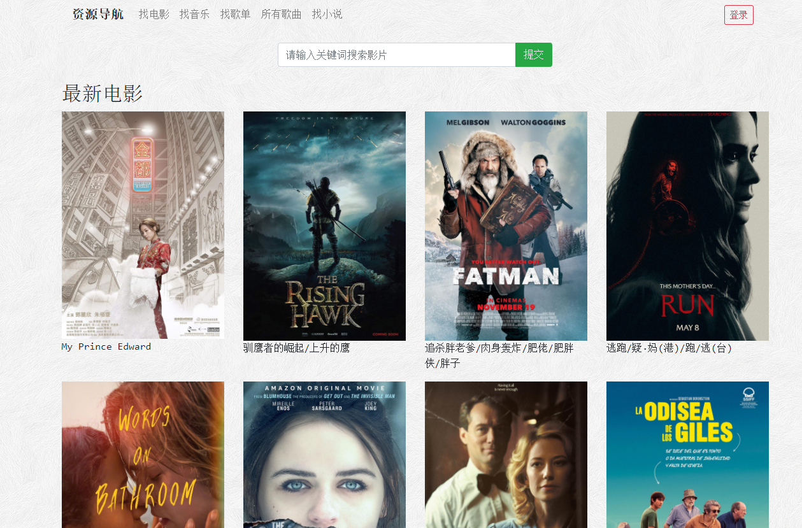
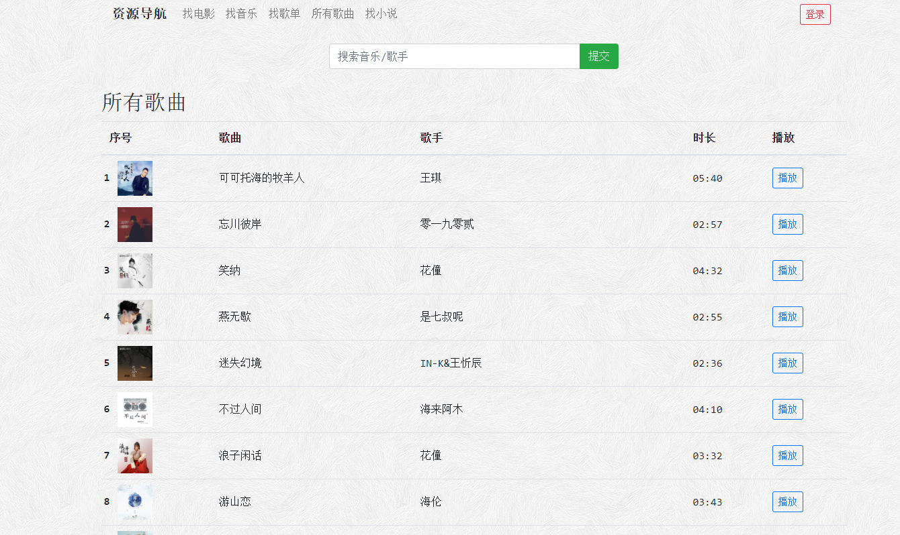
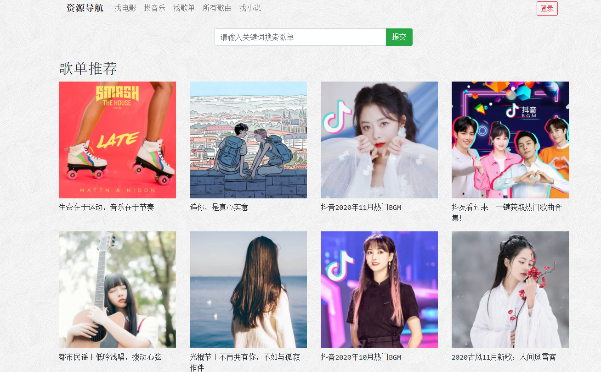
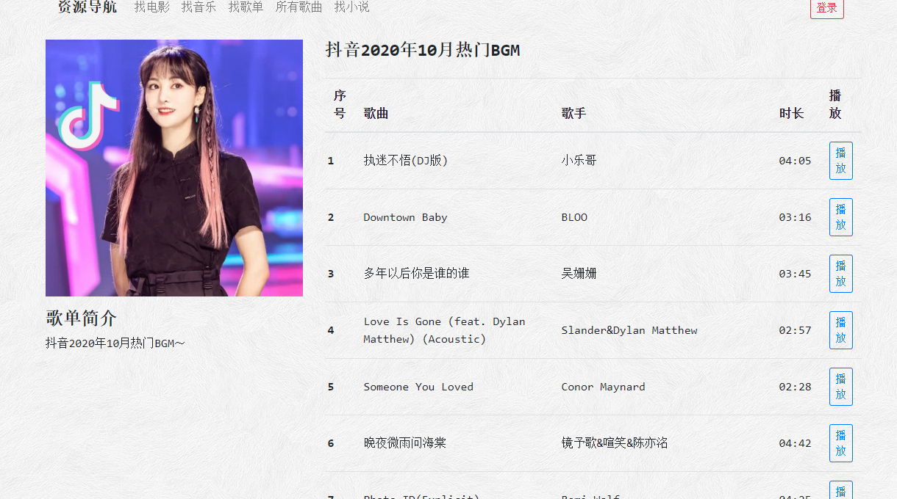

###一个可以自动获取音乐和电影信息的项目（后续有时间可以继续完善）

使用的技术：
flask：python web框架

flask-admin：flask后台管理

flask-apscheduler:创建定时任务，使用爬虫自动获取信息并更新数据库，也可以手动触发

以及爬虫相关

###快速使用：

####命令行输入

1.pip install -r requirements.txt

2.flask deploy #这一步会有些耗时，因为要从网上爬取一些初始数据，后续会通过定时任务自动执行，并且会创建一个用户名和密码均为admin的用户

3.flask run

###以下是效果图

